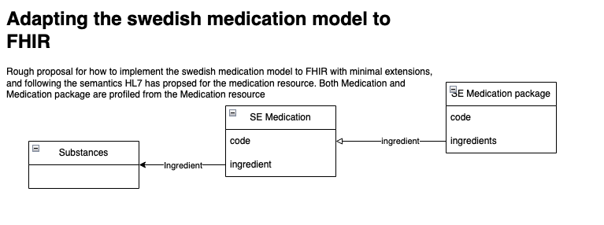

# 2025-02-07
Current proposal is based on an implementation of the swedish medication model to FHIR with minimal extensions, 
and following the semantics HL7 has proposed for the medication resource. 
Both Medication and Medication package are profiled from the Medication resource.

See 
